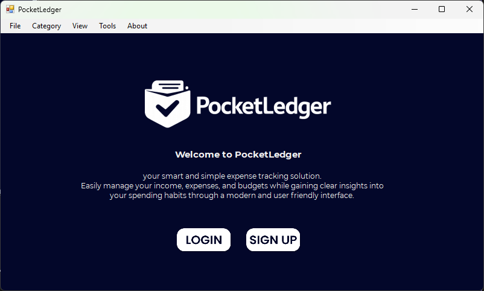

# PocketLedger - Personal Expense Tracker

<div align="center">
  
</div>

**PocketLedger** is a simple, intuitive desktop application built in C# (.NET Framework 4.7.2) designed to help individuals monitor and manage their daily financial activities. It provides a straightforward user interface to log expenses, categorize transactions, and review spending habits effortlessly, completely bypassing the complexity of massive enterprise financial tools.

## Interface Preview

<p align="center">
  
</p>

## Why PocketLedger?

Managing personal finances can be challenging without a concrete tracking system. Many users rely on manual spreadsheets or overly complex financial software that can be daunting to set up. PocketLedger fulfills the need for a focused, lightweight application dedicated purely to everyday tracking.

## Core Features

- **Transaction Logging:** Quickly and securely add incomes and expenses.
- **Categorization:** Assign categories (e.g., Food, Transport, Utilities, Entertainment) to each transaction for better budgeting and tracking.
- **Financial Review & Summaries:** View summaries of expenses over specific periods (daily, weekly, monthly) to understand spending habits.
- **Simplicity by Design:** A clean, easy-to-use interface that prioritizes essential financial tracking over useless clutter.
- **Offline & Local:** Uses local/file-based data storage, keeping your financial data on your machine without requiring a cloud connection.

## Target Audience

- **Individuals** seeking a simple alternative to complex finance apps.
- **Students & Professionals** aiming to manage personal budgets effectively.
- **Privacy-Conscious Users** looking for a locally hosted desktop app for their financial record-keeping.

## Prerequisites

- [.NET Framework 4.7.2 Runtime](https://dotnet.microsoft.com/download/dotnet-framework/net472) (if you just want to run the app)
- Visual Studio 2022 (or newer) if you plan to build or contribute to the project.

## Getting Started

1. **Clone the Repository:**
   ```bash
   git clone https://github.com/BlackBossX/personal-expense-tracker.git
   ```
2. **Open the Project:**
   Locate and open the `PocketLedger.sln` solution file using Visual Studio.
3. **Build the Application:**
   Press `Ctrl + Shift + B` to build the solution and restore any missing dependencies.
4. **Run:**
   Hit `F5` to start tracking your expenses!

## Contributing

Contributions, issues, and feature requests are welcome! If you want to help make PocketLedger even better, please feel free to check the [issues page](../../issues).

## License

This project is licensed under the MIT License.