# PocketLedger - User Interface Showcase

This document showcases the user interface screens of PocketLedger, illustrating the user experience from the landing screen to dashboard features, transaction logs, budgeting, and analytics.

---

### 1. Landing Page
The entry point of the application, welcoming users to PocketLedger.
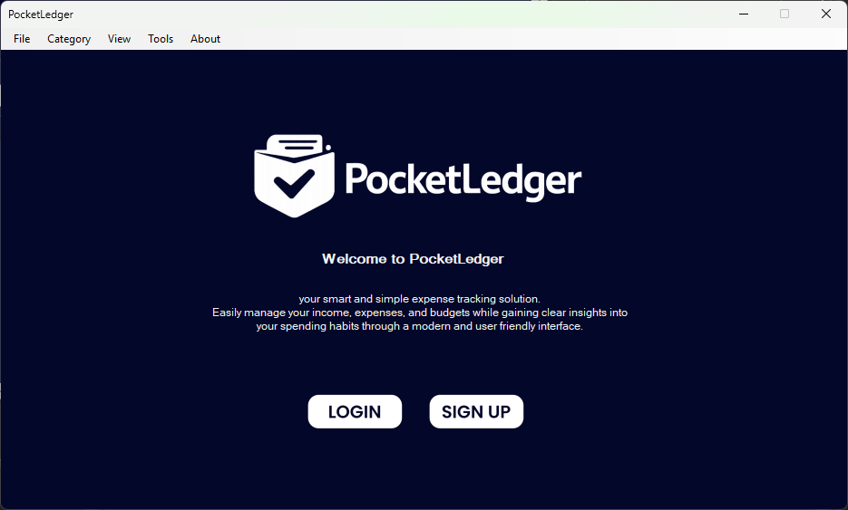

---

### 2. Authentication Flow

#### Login Page
Secure login window with user email and password authentication.
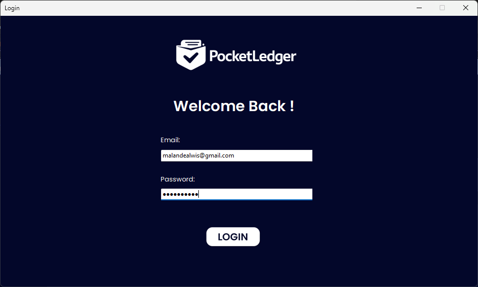

#### Sign Up (Registration) Page
User registration form featuring profile picture selection.
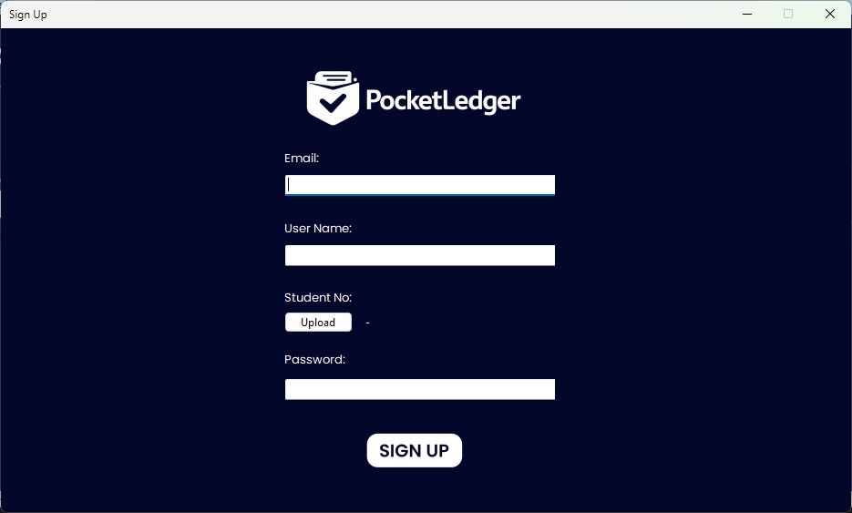

---

### 3. Core Dashboard
The main command center displaying time-aware greetings and dynamic summaries (total balance, income, expenses, budget count, savings rate, and transaction frequency).
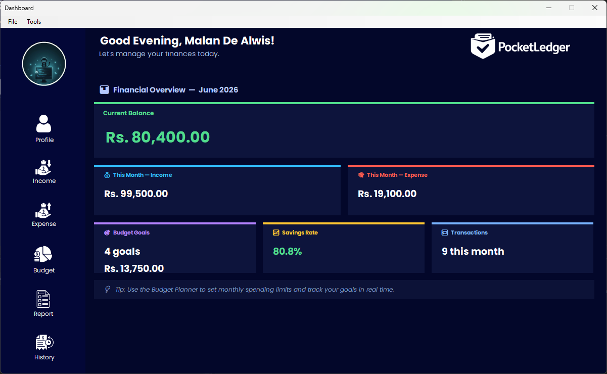

---

### 4. Transactions Management

#### Income Form
List of recorded incomes with categorization and options to review.
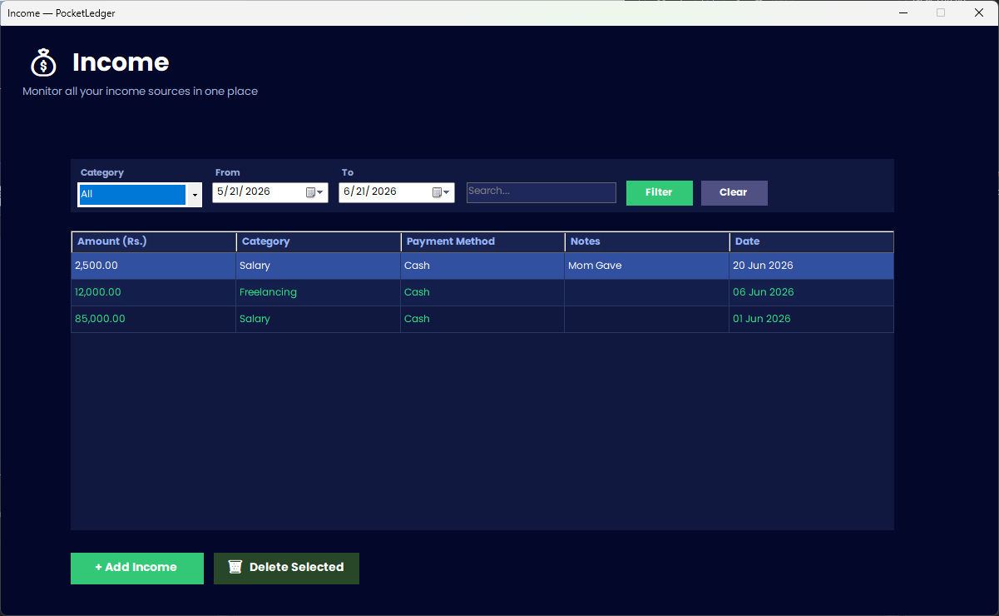

#### Add Income Dialog
Interface for recording new incoming cash flows.
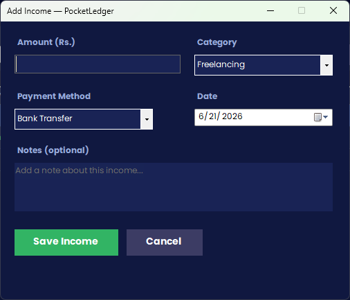

#### Expenses Form
List of recorded expenses categorized for budget monitoring.
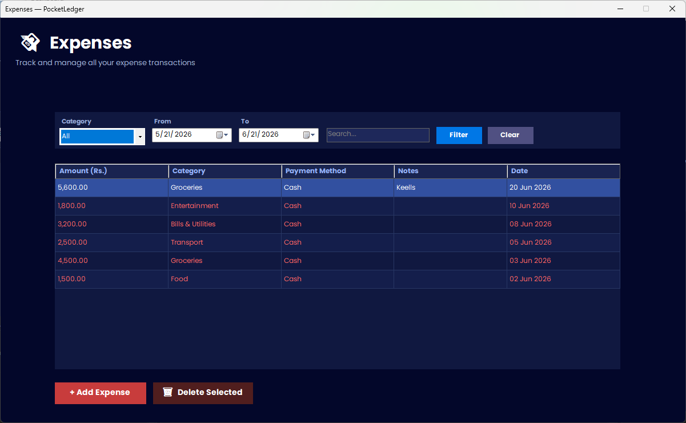

#### Add Expense Dialog
Interface for recording new outgoing expenses.
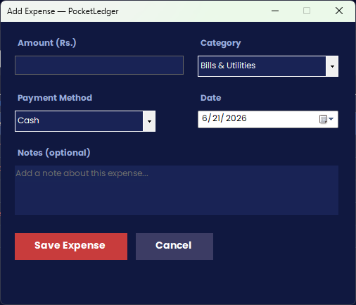

---

### 5. Advanced Budgeting & Planning
The Budget Planner displays current category limits alongside actual spent amount, remaining balances, and automated safety warning statuses.

---

### 6. Transaction History
A comprehensive history ledger equipped with search, category filtering, and date range filters.
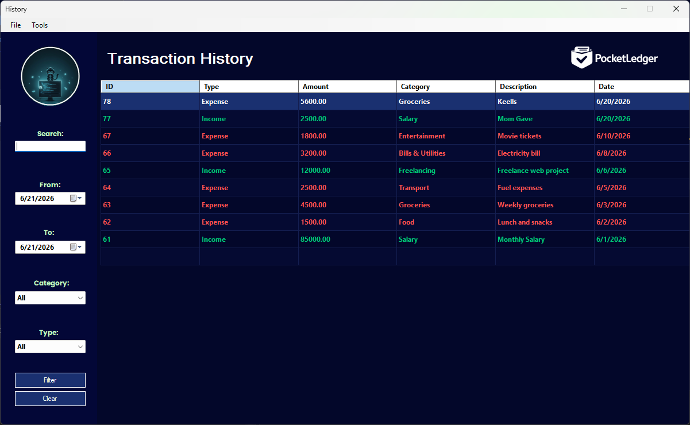

---

### 7. Analytical Reports
Visual summaries and reports showing categorical breakdowns and monthly comparison records.
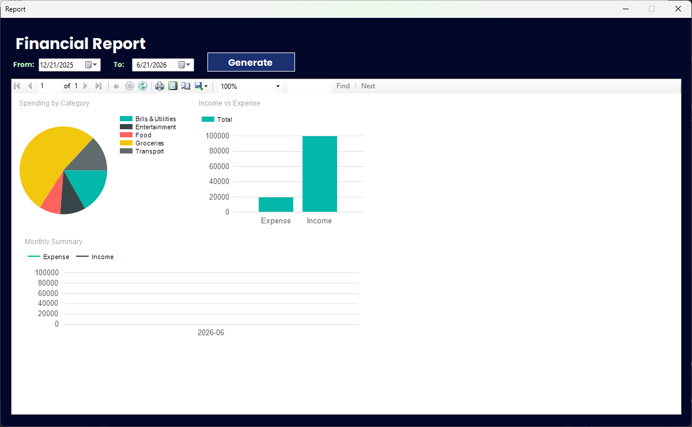

---

### 8. User Profile
A dedicated space to update usernames and change user avatars.
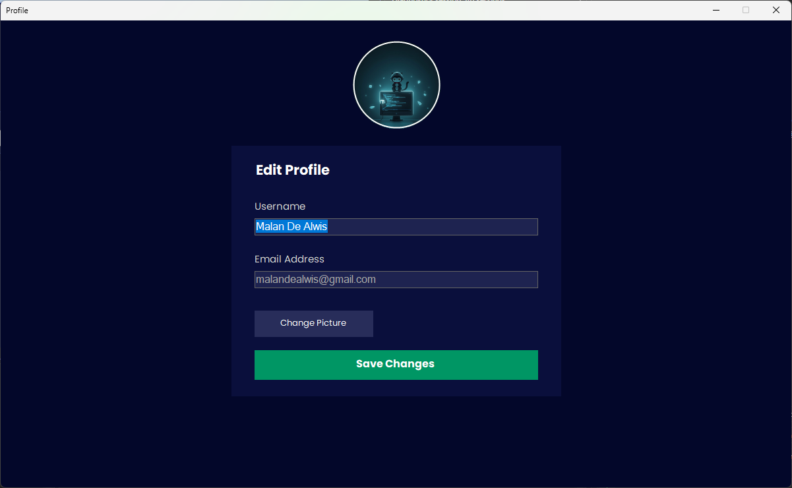
